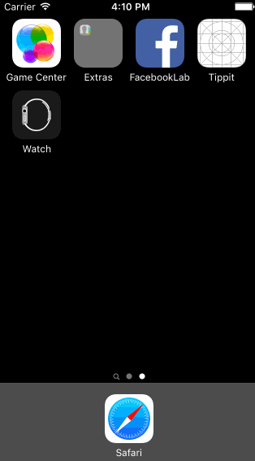

## Facebook - WEEK 1 LAB
Time spent: `3`

### Features

#### Required

- [x] User can tap through and scroll each tab of the app
- [x] User can enter story detail view
  - [x] User can like post
  - [x] User can scroll story
- [x] User can tap into composer options and close them

#### Optional

- [x] User can tap comment input to open keyboard
- [ ] User can tap comment button in feed to go to story detail view with keyboard open

#### The following **additional** features are implemented:

- [ ] List anything else that you can get done to improve the app functionality!

Please list two areas of the assignment you'd like to **discuss further with your peers** during the next class (examples include better ways to implement something, how to extend your app in certain ways, etc):

1. Ways to copy viewcontroller funtionality that's pretty much identical (tedious to implement each view controller with nav bar and scrollview)
2. How to make view respond to different segues (I couldn't figure out how to make the keyboard only open in the story detail view when entering it via the comment button)

### Video Walkthrough 

Here's a walkthrough of implemented user stories:

GIF created with [LiceCap](http://www.cockos.com/licecap/).

## Notes

Describe any challenges encountered while building the app.

The height of the status bar kept being added to the inset of my scroll views. Needed to add `self.automaticallyAdjustsScrollViewInsets = false;`
